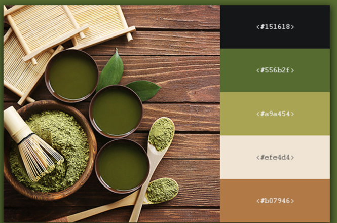

#### How to create your own blog with this repo

- Basic setup
    - Prerequisites: learn about ReactJS and GatsbyJS.
    - Recommended: Use `nvm` to switch between Node versions. This project is confirmed to work with v12.16.3.
    - Fork and `npm install`.
    - Run in development mode with `gatsby develop`. First run will take several minutes, but subsequent runs will be faster.
    - Run in production mode with `gatsby build && gatsby serve` (or `./fastbuild.sh`). If you want to delete `cache` and `public` before building, use `./slowbuild.sh` (recommended for releases to avoid leaking development data). You may have to make the scripts executable before you are able to run them (`chmod +x filename`).
- Make it your own
    - Go through everything in `content/meta/config.js` and `content/pages` and `content/parts`
    - Search all files for "atte".
    - Replace `static/preview.jpg` (this is the image that is used when someone shares a link to your blog on a social network like Reddit). Recommended aspect ratio is 1.91.
    - When you publish, make sure caching and redirects work reasonably. I recommend Netlify, in which case cache configuration in `static/_headers` is fine and you just need to edit 1 line in `static/_redirects`.
    - Move your own icons into `src/images/app-icons`, run `npm run generate-app-icons`, then replace `static/favicon.ico`.
    - Environment variables can be set in a `.env` file. It's good practice to keep it in `.gitignore` so it doesn't get published to the repo. When you publish your website, find out how you can add environment variables to your host without publishing the `.env` file. If you are wondering why environment variables are used, it is to prevent people from accidentally spamming (for example, people who forked this repo used to test the contact page by sending me messages like dffdsffdsfd).
    - Add [Plausible Analytics](https://plausible.io/): add `PLAUSIBLE_DOMAIN=mywebsite.com` to environment variables. Note that this variable is also used for OpenGraph (social sharing) tags, so if you don't set this variable, you need to fix the OpenGraph pathing.
    - There is an e-mail newsletter link on the `Subscribe` page. Remove it or set up a newsletter and add the URL as an environment variable `EMAIL_SUB_LINK`.
    - There is a Contact page. Remove it or set up handling for your form submissions. The POST address where forms are sent is defined in environment variable `CONTACT_POST_ADDRESS`. I'm using Google Script to handle form submissions. If you also want to use Google Script, [instructions are here](https://github.com/dwyl/learn-to-send-email-via-google-script-html-no-server) and [here is an improved version of the script](handleFormSubmission.gs).
    - [OPTIONAL] If you want a "Hero" section at the top of the home page, just set `hero.hide` to `false` in `theme.yaml`.
- Creating content
    - Blog posts are in `mock_posts` and `posts` folders. By default only mock posts are used (to help you tweak the website before you have a lot of content). You can switch to real posts by creating an environment variable `POSTS_FOLDER=posts`. Please try not to accidentally repost my real posts if you are only tinkering.
    - When you create posts, a folder with a name like `2020-03-05--my-book-review` will be published, whereas a name like `my-book-review` will be considered a draft and will not be published. There are ways to accidentally publish drafts. If you are worried about that, the easiest way to avoid it is to deploy your site from GitHub via Netlify and _never commit draft posts to the repo_.
    - You have to manually crop images to 2.222 aspect ratio.

background #F9F7F4
red: #d03b39
green: #107C64
yellow: #EBB338
orange: #FFB18B
olive: #4F4E16
brown: #A2755E
dark-grey: #1F1F1F

You have to manually crop images to 2.222 aspect ratio.
4096
1845

https://cupofjo.com/

source $(brew --prefix nvm)/nvm.sh
nvm use v14.15.0
gatsby develop
