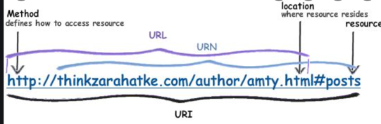

Привет! В предыдущей статье мы узнали основы клиент-серверной архитектуры.
Мы уже знаем, что когда клиент делает первый запрос на сервер, то сервер возвращает нам HTML страницу сайта.

На самом деле для того, чтобы отвечать на запросы клиента на сервере запущена специальная программа, которая называется *веб-сервер*.
> Веб-сервер - это программа, которую программисты установили и настроили на своем сервере так, чтобы она отдавала данные клиентам

PIC, где отмечен веб сервер

Как веб-сервер понимает, какие данные ему отдать в ответ клиенту?

Как мы помним, запрос - это текстовая строка, которую формирует клиент (тот самый протокол HTTP). Внутри запроса содержится информация о том, какую страницу или данные мы хотим получить с сервера.
Эта информация передается в так называемом *URL*.
 подписать, где "сервер какой компании", где "путь до ресурса"
> URL - unified resource locator (унифицированный указатель ресурса). В строке URL содержится информация о тех данных, которые мы хотим получить с сервера.
> Там есть доменное имя, то есть то, с какого сервера мы хотим загрузить данные. И также есть путь до ресурса, то есть то, какую HTML страницу мы хотим получить.

Пример: Веб-сервер сайта yandex.ru настроен таким образом, что на запрос https://yandex.ru/ он отдает главную страницу, а на запрос https://yandex.ru/pictures отдает страницу с картинками.

## Статические запросы
В начале 2000-х сайты в интернете работали так, как мы описали выше.

1. Клиент делал запрос за главной страницей
2. Сервер отдает готовую HTML страницу
3. Клиент пользовался страницей и нажимал на какую-нибудь ссылку на странице
4. Браузер отправлял запрос на сервер за новой HTML страницей

> Статические запросы - это те запросы, на которые веб-сервер отдает в ответе заранее заготовленный файл. Этот файл он хранит в файловой системе сервера.
> Чаще всего речь об HTML, CSS, JS файлах.

## Динамические запросы
Представим, что у нас есть сайт с новостями. Мы прочитали первую страницу новостей и хотим открыть вторую.

PIC нарисовать страницу с новостями и пагинацией, палец(cursor pointer) нажимает на вторую страницу

Чтобы открыть вторую страницу, мы должны отправить запрос на сервер за новой HTML страницей.

Но можно заметить, что вторая страница будет очень похожа на первую и изменятся только заголовки новостей.
Становится очевидно, что запрашивать целую HTML страницу смысла нет и нам достаточно получить файлик,
в котором просто будут заголовки статей, а затем их можно подставить в старый HTML файл.

Так и появились динамические запросы...

> Под динамическими запросами понимают запросы на сервер, ответ которых серверу заранее не известен.
> Ответ на запрос начинает формироваться в тот момент, когда сервер получил запрос от клиента.
> Чаще всего в этот момент сервер либо идет за свежими данными в **базу данных**, либо что-то вычисляет с помощью программного кода

PIC картинка с запросом за первой страницей новостей (клиент-сервер), за второй страницей новостей.

Запрос за новостями - это как раз динамический запрос. На клиенте динамический запрос обычно формируется за счет Javascript, но о работе клиента поговорим в следующий раз.

Запрос за динамическими данными выглядит точно так же, как и запрос за статическими.
Веб-сервер будет заранее настроен таким образом, что на запрос https://yandex.ru/news он вернет HTML страницу,
а на запрос https://yandex.ru/api/news?page=1 вернет заголовки и текст самих новостей.

**ВАЖНО:** Становится понятно, что клиент может отправлять на сервер запросы только по определенным URL,
так как у веб-сервера необходимо заранее запрограммировать ответ на каждый! URL

Динамические данные принято отдавать с сервера в формате *JSON*.
> JSON - JavaScript Object Notation. Это обычный текстовый формат, который построен по принципу ключ-значение.
> Так называется, потому что структура JSON файла очень похожа на описание объектов в языке Javascript

Пример JSON файла с новостными статьями:
```json
[
  {
    "title": "название новости 1",
    "text": "текст статьи 1 ..."
  },
  {
    "title": "название новости 2",
    "text": "текст статьи 2 ..."
  }
]
```

Мы вплотную подобрались к изучению бэкенда (того, что происходит на сервере). Stay tuned!
